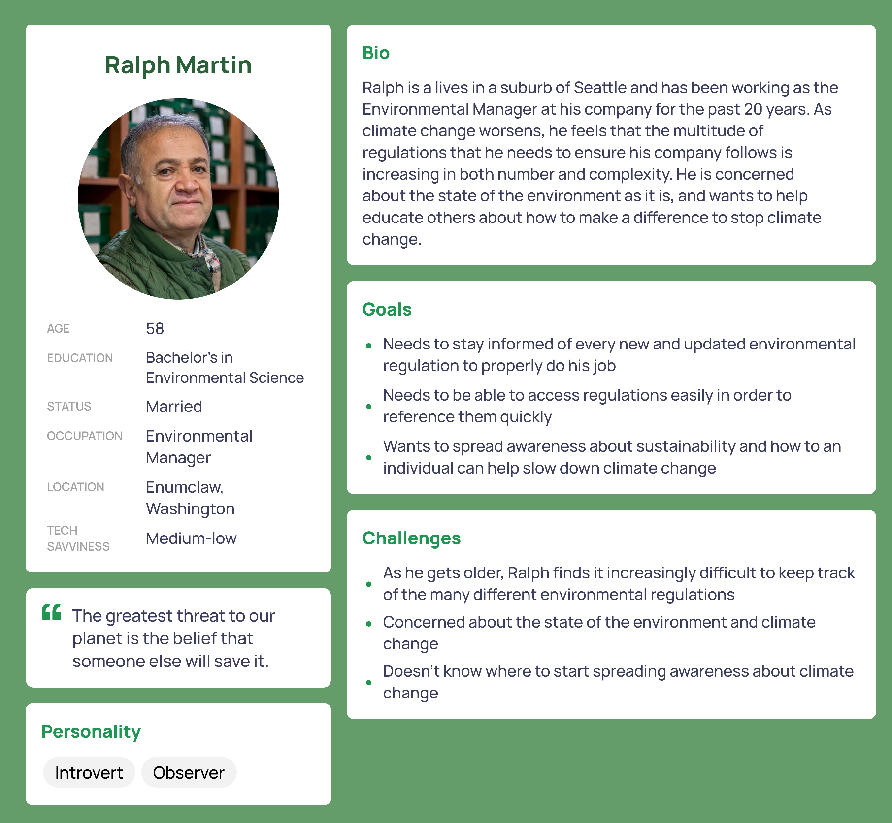
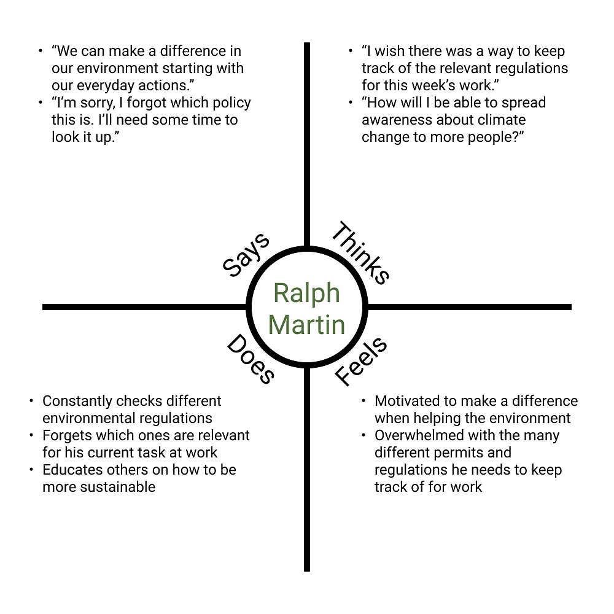
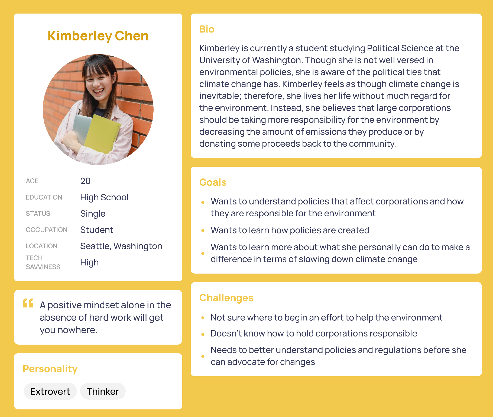
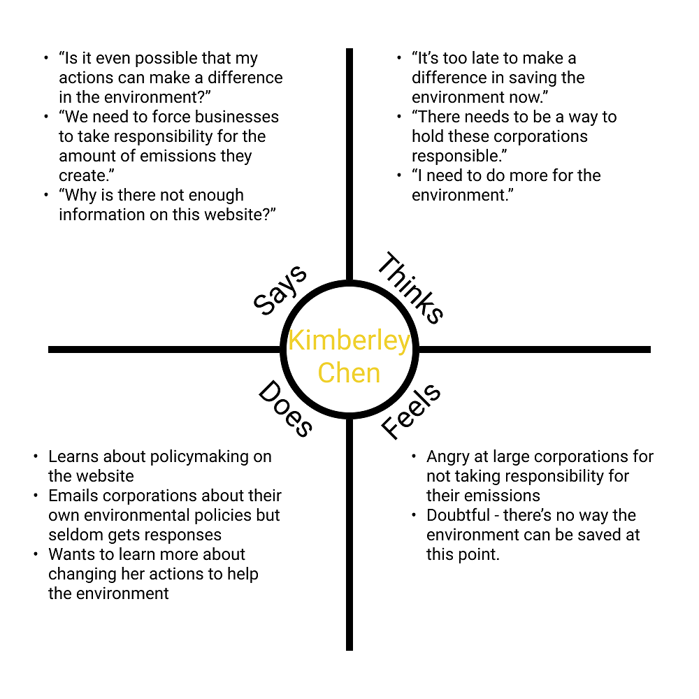
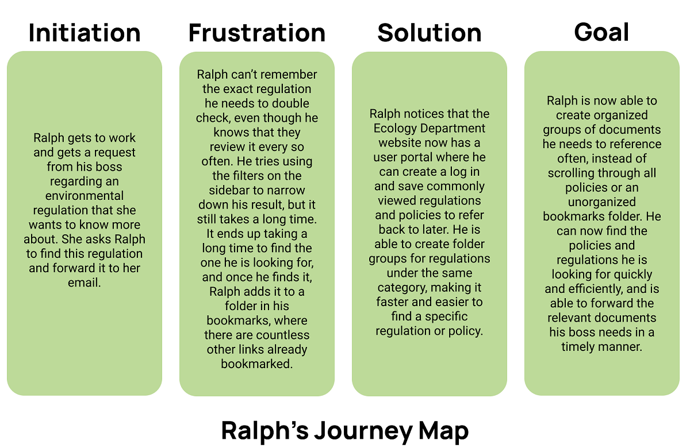
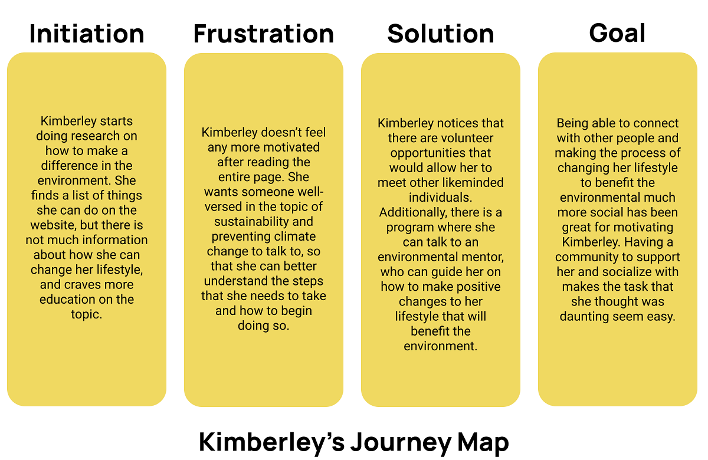

# Assignment 04: Creating Personas and Scenarios
**Author:** Evelyn Hu  
**Course:** DH110 User Interface and Design  
**Description:** Using my prior contextual inquiry and user research, I have created personas and scenarios as a proposal to implement features to make the Washington State Department of Ecology website more accessible.

## The Purpose of UX Storytelling
UX storytelling is important in that designers can sometimes forget the fact that they're designing a product for *other people's* usage. When spending a long time tunnel visioning on designing their product to be the best it can be, they may lose sight of who the target audience is and what it is that they actually want from the product. Therefore, UX storytelling helps designers ground themselves by creating personas to better envision how the product should be designed to be the most relevant to the user's needs. Using personas for storytelling helps designers view their product from a different perspective and create a better and improved product.

## Improving the Washington State Department of Ecology Website
**1. Implementing a user portal to keep track of regulations & permits**  
As there are many regulations and permits (4109, to be exact) listed in the portal on the website, it may be difficult to keep track of all of these. Therefore, implementing a user-friendly portal where users can log in, save commonly referenced regulations and permits, be notified of any updates, and be able to easily share links with coworkers would be beneficial to users.  
**2. Improving the "What you can do to reduce greenhouse gases" page**  
As it is now, the "What you can do to reduce greenhouse gases" pages on the website is rather bare-bones and lacks functionality; it simply lists information that users would likely already know. In order to encourage users to make a greater effort, this page should be updated with new and relevant information, such as suggestions on where to volunteer, and opportunities for people to educate and be educated about sustainability. Climate change is not an issue that can be solved alone; therefore, creating a sense of community would be useful in encouraging users to act in prevention of climate change.

## Persona & Empathy Maps
### Persona 1: Ralph Martin
  

#### Ralph's Empathy Map
  

### Persona 2: Kimberley Chen
  

#### Kimberley's Empathy Map
  

## User Scenarios & Journey Maps
### Ralph's Scenario & Journey Map
#### Why Ralph is using this product
> Ralph is the Environmental Manager at his company, which produces a considerable amount of greenhouses gases and other emissions. He needs to ensure the company is responsible for following all of Washington State's regulations and policies; however, there are a great number of such policies that he needs to keep track of, and the policies are constantly changing. As he is getting older, he finds it difficult to stay organized and thinks the website's regulation portal is getting difficult to use as the number of things he needs to stay on top of increases.
#### How Ralph is using this product
> When he gets to work in the morning, Ralph types the full URL, "https://ecology.wa.gov/" into his search bar and presses enter. He first scrolls down to the "News" section of the website to ensure that he is up to date on the latest news regarding the environment. He then clicks the "Regulations & Permits" link to enter the portal, where he is met with a large list of 4109 different regulations and policies. He suddenly forgets which policy he wanted to look up for his work today, so he spends 30 minutes refining his search using the filters on the left side before finding the one he is looking for.
#### Ralph's Journey Map
  

### Kimberley's Scenario & Journey Map
#### Why Kimberley is using this product
> Kimberley is currently a student studying Political Science and hopes to one day help create environmental policies that big corporations need to follow. She sees this as her long-term goal, yet the problem of climate change looms over her head every day; lately, she feels as though she needs to make more efforts, now, to delay climate change, rather than wait until she finishes her education. However, she feels as though the task is very daunting and wants to learn how she can take the first step to make a difference in slowing down climate change.
#### How Kimberley is using this product
> Kimberley is doing research on the first steps she can take to help prevent climate change, so she types "What I can do to stop climate change" into the Google search bar. She finds the "What you can do to reduce greenhouse gases" page on the Washington State Department of Ecology website and decides to click the link, as she thinks a government website is credible and trustworthy. However, as she scrolls through the page, she finds information that she already mostly knew, and is not any more motivated to begin making changes to her lifestyle. She feels like there is something missing from the page that would help motivate her.
#### Kimberley's Journey Map
  

## Reflection
